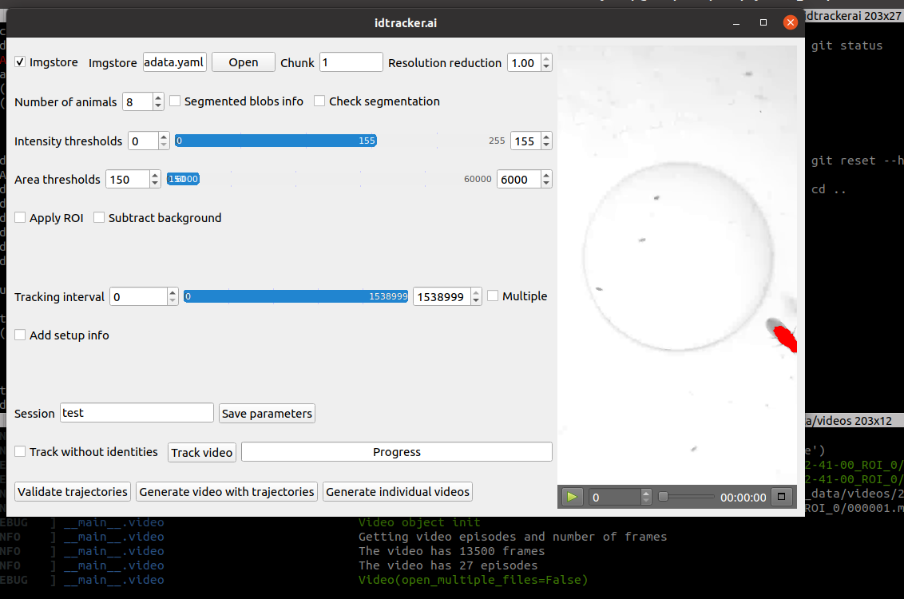

idtrackerai.ai
=======================

We use idtracker.ai to segment and track multiple individuals in the same arena


Once a recording has been completed, you can analyze with idtrackerai, like this:

## Set analysis params in the GUI

1. Open the imgstore with idtrackerai



2. Required input:

* Number of animals
* Area thresholds
* Intensity thresholds
* Session name (datetime)
* Apply ellipse ROI. Provide 5 interspaced points along the outer outline of the glass dome

-> Save parameters with name _datetime_.conf

3. Open the _datetime_.conf file and remove

1. Session name
2. Video name
3. Chunk number


## Schedule chunk analysis

```
cd $ROOT_OF_VIDEOS_FOLDER

idtrackerai-loop --input `pwd`/./2022-03-11_22-41-00_ROI_0 --interval 0 5 --knowledge-transfer previous --environment idtrackerai4 --suffix ""
```

# idtrackerai repository version
62391f982531f3b8ab665d5f753bda169ed9dada


# task spooler
https://github.com/justanhduc/task-spooler
https://github.com/justanhduc/task-spooler/releases/tag/v1.3.0
