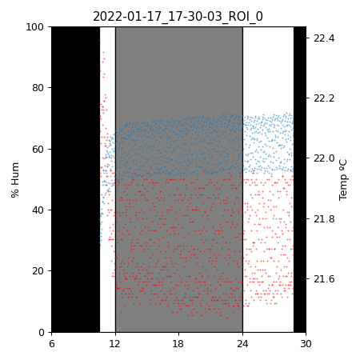
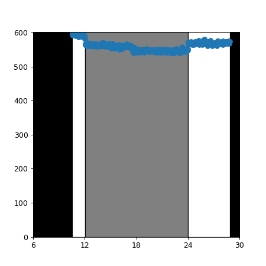

Sensor
===========

# Quick start

1. Install the [flyhostel](https://github.com/shaliulab/flyhostel/) Python module

```
git clone https://github.com/shaliulab/flyhostel/
cd flyhostel
pip install .[sensor]
```

2. Flash [the Arduino sketch](https://github.com/shaliulab/flyhostel/blob/master/src/arduino/sensors/sensors.ino)

3. (optional) Verify connectivity

2.1 Arduino Uno is available under `/dev/ttyACM0` 
2.2 Arduino Uno can detect the sensor on a computer with Arduino IDE installed
2.3 Once the right Port and Board are selected, open the Serial Monitor (Tools > Serial Monitor). Make sure you have Newline and 9600 baud selected

Press `T` to have the Arduino "Teach" the computer what is its job. The Arduino should return back the following

```
{name: Environmental sensor, version: X}
```

Press `D` to have the Arduino send "Data" to the computer. You should see the following returned

```
{"temperature": 21.43, "humidity": 62.83, "light": 391}
```

**NOTE: The first time you send a command, you may have to press twice**


4. Deploy

3.1 Connect the Arduino to the RaspberryPi via USB. This connection provides power to the Arduino+sensor and serves as data bus to the RPi
3.2 On the RaspberryPi, run:

```
fh-sensor --arduino-port /dev/ttyACM0 --html-port 10000 --json-port 9000 --thread
```

This will listen to the Arduino device under `/dev/ttyACM0`, run in the background (`--thread`) and spawn 2 HTML servers, one which renders a dashboard under port 10000, and another one which yields a simple JSON with the same information. One could thus go request IP:10000 to access the website, or IP:9000 to access the data. This can be done in a browser or in the CLI with curl

5. Get data

```
curl IP:9000
# returns
# {"temperature": 21.43, "humidity": 62.83, "light": 391}
```

where IP is the IP address the RaspberryPi has acquired on the network.


6. Plot data

The environmental data stored in an imgstore dataset can be visualized with the following command

```
fh sensor-io --input IMGSTORE_FOLDER --output OUTPUT_FOLDER --zt0 X
```

This will produce two plots.

Temperature and humidity measured throughout the recording as a line plot, and shaded according to LD phase, based on the `--zt0` argument



Light: voltage measured by Arduino behind the photoresistor. A high voltage indicates a strong light shining on the photoresistor and viceversa. Thus, this number can be read as light intensity, in A.U.

<!--  TODO Show better plot -->



## Introduction

Any long-term behavioral recording needs to control that the environmental conditions stay within limits, so as to ensure there are no behavioral artifacts.
FlyHostel uses a custom design environmental sensor, based on the [AdaFruit BME280](https://www.adafruit.com/product/2652) chip.
The sensor reads

* temperature
* humidity
* light

It is connected to an Arduino, which communicates with the electric circuit, and relays the information to a RPi, which in turn spawns an HTML server that other processes can access to query the environmental conditions. FlyHostel recordings embed this information in the resulting data thanks to [imgstore](https://github.com/shaliulab/imgstore)'s ability to save video and other associated data.

```
environmental_data = self._sensor.query(timeout=1)

self._save_extra_data(
    temperature=environmental_data["temperature"],
    humidity=environmental_data["humidity"],
    light=environmental_data["light"],
    time=timestamp,
)
```

These data are saved in .json files stored in the same folder as the video files, with the following structure

```
[{"temperature": 21.43, "humidity": 62.83, "light": 391, "time": 360338, "frame_time": 360407, "frame_number": 15348, "frame_index": 15348, "frame_in_chunk": 1848}, ...]
```


## Components

### Software
 
   * A python module, running in the RPi and provided by the [`flyhostel.sensors`](https://github.com/shaliulab/flyhostel/tree/master/flyhostel/sensors) module.
       This module reads the information obtained by Arduino and relays it upon HTML requests in JSON format
   * A C++/Arduino sketch, which interfaces the Rpi and the sensor, and is stored [here](https://github.com/shaliulab/flyhostel/blob/master/src/arduino/sensors/sensors.ino)

### Hardware

1. [BME280 sensor](https://www.adafruit.com/product/2652) (temperature and humidity)
2. [Photoresistor](https://create.arduino.cc/projecthub/MisterBotBreak/how-to-use-a-photoresistor-46c5eb) (light)
3. 10KOhm resistor
4. Breadboard
5. Arduino Uno
6. RaspberryPi

NOTE. A BMP280 sensor exists which does not measure humidity.


##### Circuit

* 10kOhm resistor and photoresistor need to be connected in series
* The remaining pins are connected to 5V and GND.
* The series connected pins should be connected to A0


4 headers need to be connected: 5V, GND, SDI (A4) and SCK (A5).

|  Arduino board |    Headers    | Component |
|----------------|---------------|-----------|
|   5V           |   VIN         |  BME280   |
|   NA           |   3V          |  BME280   |
|   GND          |   GND         |  BME280   |
|   A5           |   SCK         |  BME280   |
|   NA           |   SDO         |  BME280   |
|   A4           |   SDI         |  BME280   |
|   NA           |   CS          |  BME280   |
|   A0           |   PHR2/10kOhm |  PHResist |
|   5V           |   PHR1        |  PHResist |
|   GND          |   10 kOhm     |  PHResist |
